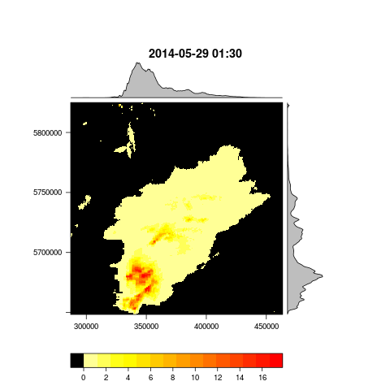
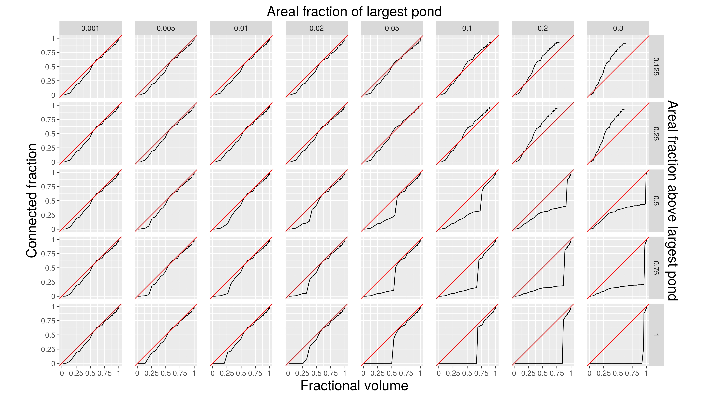
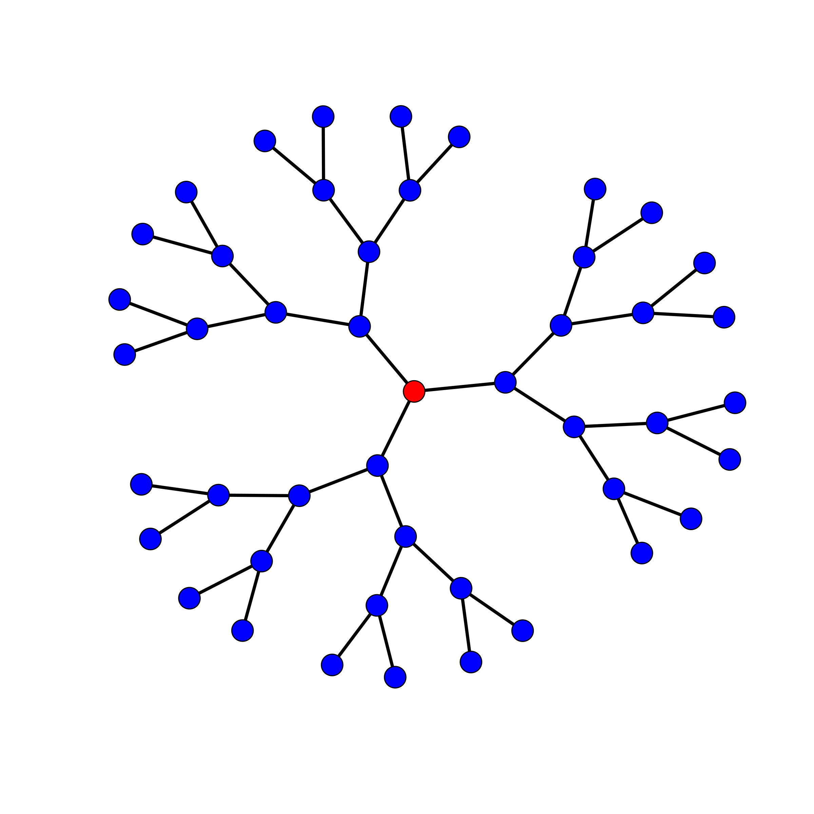
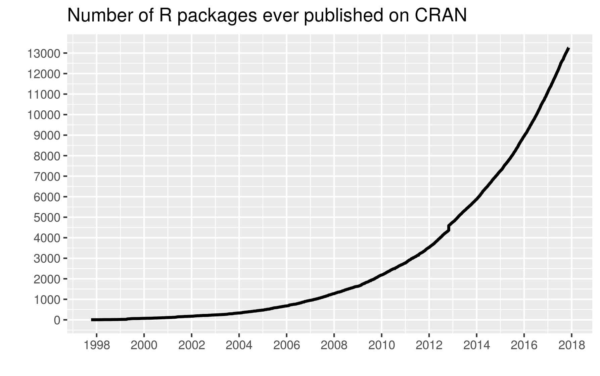
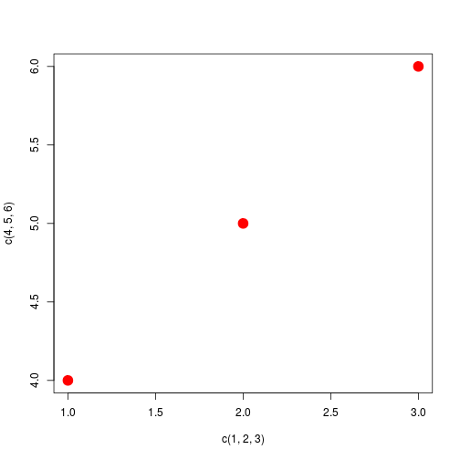

Introduction To R
========================================================
author: Kevin Shook
date: November 23, 2017
autosize: true
css: style.css


Objectives
========================================================
- To explain what R is, and what it can be used for
  - Will focus on *why* and *what*, rather than *how*
  - Future seminars will cover details of how to use R
- Will be giving a live demonstration of some of the capabilities of R

Reproducible research
========================================================
- Need to know what you did, and to be able to re-do it
- Have to justify your results
- Need to be able to re-do work due to changes or mistakes  

Typical research workflow:
========================================================
- Reading in data (text files, databases, .xls)
- Data massaging
- Data exploration (trial calculations, plotting)
- Final calculations
- Saving results
- Exporting data for other programs to use
- Creating publication graphs
- Writing a paper/thesis

What is R?
========================================================
- R began as a statistical programming language
- It's now a general-purpose scientific program
- R allows you to write scripts to automate your work
- Can combine text, equations, R code, output and figures in a single output document
  - Creates automatically-updated documents
  - Results in self-documenting, reproducible research

Why "R"?
========================================================
- S-plus is a proprietary statistics program
  - uses the S language
- R is a Free Open Source implementation of the S language

Why use R?
========================================================
- Excellent for statistics, advanced data processing and graphing
- Free Open Source Software
  - Can see, test and verify the source code
- Uses standard file formats - no lock-in
- Huge number of packages available
- Works well with other programs

Statistics
========================================================
- R is the standard program for statistical analyses
- Widely used for teaching statistics
- Can do any type of statistical analyses that you need   
 
 


Data crunching
========================================================
- R is excellent for massaging for all types of scientific data
  - can read data from almost any source including spreadsheets and databases
  - time series
  - spatial data
  - categorical data
- Widely used for "big" data

Graphing
========================================================
- R is arguably the best program for scientific graphing  

  

***  

  



GIS
========================================================
- R can do very sophisticated GIS analyses


Getting R
========================================================
- Download R from
 https://www.r-project.org/
  - Available for all platforms
- Then, install Rstudio (GUI)
  - also FOSS
  - https://www.rstudio.com/

Packages
========================================================
- Enormous amount of R-code is available



R demonstration
======================================================== 
type: prompt

Graphing
========================================================
- Standard (built-in) graphing uses the command plot:

```r
plot(xvals, yvals, options)
```
- Easy to use from the command line
- Good for quick and dirty plots
- Can get better results for publication using another package

***

```r
plot(c(1,2,3), c(4,5,6), type="p", col="red", cex=2, pch=19)
```




ggplot2
========================================================
- R package by Hadley Wickham
- gg = grammar of graphics  
- Help available at http://ggplot2.tidyverse.org/reference/
- Book: ggplot2: Elegant Graphics for Data Analysis  


Why ggplot2?
========================================================
- Creates amazing publication-quality graphics very easily
- Based on work of Edward Tufte  

- Uses a grammar for graphs
- Can change graphs interactively
- Extremely good for categorized data

Grammar of graphing
========================================================
- Graphs are made of

|Definition | Short name |
|------|-----|
| Aesthetics | aes |
| Geometric objects | geom |
| Statistical transformations | stat |
| Scales | scale |
| Faceting | facet |
| Theme | theme |

Creating a ggplot2 graph
========================================================
class: small-code
- Create a ggplot2 object in a variable  

```r
p <- ggplot(dataframe)
```
- Add an aesthetic defining the columns  

```r
p <- p + aes(xvals, yvals)
```
- Add a geometry 

```r
p <- p + geom_point()
```
  
***

- Add stats, themes, scales, facets  

```r
p <- p + theme_gray(18) +
xlim(0, 5)
```
- Display  - type the variable name 

```r
p
```
- Save to a file  

```r
ggsave("graphfile.png")
```
  
ggplot2 data
========================================================
- ggplot2 requires values to be stored in data frames that are tall, not wide
- Opposite of standard R graphs
  - Takes some getting used to
- Worth the effort, as it is *much* more powerful
- Allows you to use categories in your plots
- Tools available to convert your data from wide to tall

Wide data
========================================================
- Like a spreadsheet: each variable's value in a separate column
- Inflexible, doesn't allow for multiple classifications
- Doesn't deal well with differing numbers of values
- Doesn't tell us what the data represents 
  - not very reproducible  

|Time|Saskatoon|Regina|Calgary|
|------|-----|-----|----|
|00:00:00| -7 | -7| -1 |
|01:00:00|-5 | -9| -2 | 
|02:00:00| -5	|  -9 | -3|
|03:00:00| -6 |	-1| -2 |
|04:00:00| -6 | -9| -3 |
|05:00:00| -6 |-11| NA |

Tall data
========================================================

|Time|Temp|Location|
|------|-----|-----|
|00:00:00| -7 | Saskatoon|
|01:00:00|-5 | Saskatoon|
|02:00:00| -5	| Saskatoon|
|03:00:00| -6 |	Saskatoon|
|04:00:00| -6 | Saskatoon|
|05:00:00| -6 |Saskatoon|
|00:00:00| -7 | Regina|
|01:00:00| -9 | Regina|
|02:00:00| -9 | Regina|
|03:00:00| -1 | Regina|
|04:00:00| -9	| Regina|
|05:00:00| -11|	Regina|
|00:00:00| -1 | Calgary |
...

ggplot2 demonstration
======================================================== 
type: prompt


Challenges
========================================================
- steep learning curve
  - have to learn many new commands  
  
## "R makes easy things hard and hard things easy"  

But:  
- *lots* of support and information available
- will be doing more training

Resources
========================================================
Rseek (Google for R):  
http://rseek.org/  

R reference card:  
https://cran.r-project.org/doc/contrib/Baggott-refcard-v2.pdf  

Books and manuals:  
An Introduction to R  
https://cran.r-project.org/doc/manuals/r-release/R-intro.pdf  

***

R for beginners  
https://cran.r-project.org/doc/contrib/Paradis-rdebuts_en.pdf  

The R guide  
https://cran.r-project.org/doc/contrib/Owen-TheRGuide.pdf  

The R Reference Index:  
https://cran.r-project.org/doc/manuals/r-release/fullrefman.pdf  

This presentation
========================================================
- All of the files for this presentation can be downloaded from
https://github.com/CentreForHydrology/Introduction_to_R
